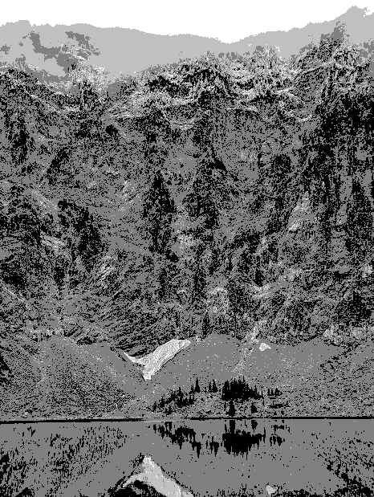

# image processing

This package intends to offer some different image processing capabilities

## Usage

### Install dependencies

Run `yarn` from the root of the repo or `npm install` from the root of the package.

### Run a task

`npm run <task>` from the root of the package passing on the required parameters.

### As a library

The code is built exposing tasks that can be used directly from other packages as parameters.

## Available tasks

### image-to-monochrome

Takes an image path and recreates the image translating the colors to a monochrome scale.

### image-to-binary

Takes an image path and recreates it translating it to a binary representation, each pixel is either black or white. The tonality is achieved by increasing the resolution by a squared factor (defaults to 16=4x4) to represent the grays after being normalized.

#### Example input

#### Example output

### image-to-binary-by-component

Takes an image and regenerates it by using binary values of the color components (RGB) to be either on or off.

#### Example input

#### Example output

